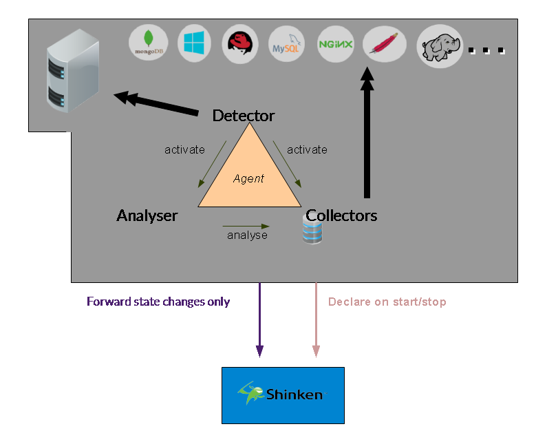
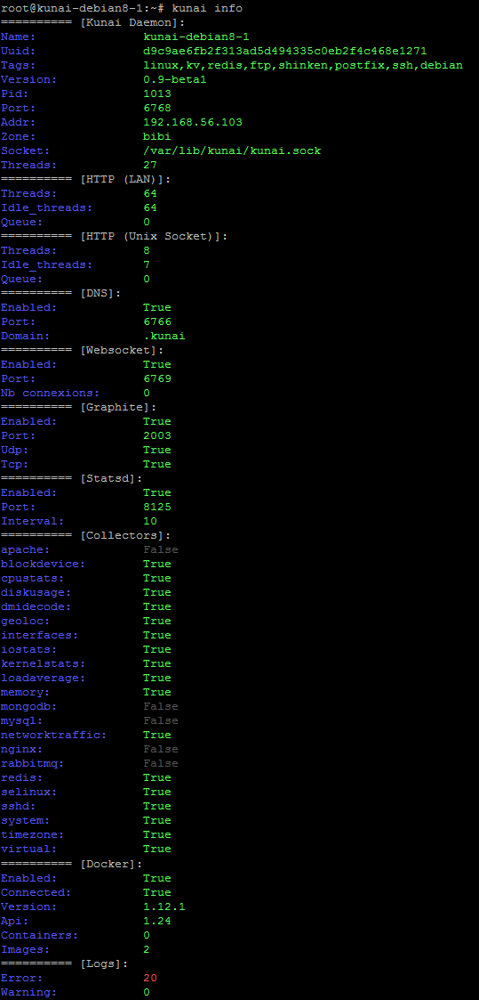
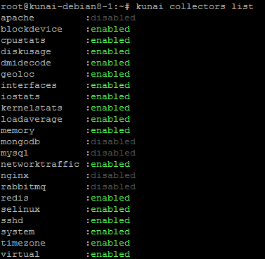

This is a first release of the kunai project about a service discovery / monitoring / light cfg management / command execution tool.

## **Kunai**: monitoring and service discovery

## Installation

#### Prerequites
You will need:

  * python >= 2.6 (but not 3 currently)
  * python-leveldb
  * python-requests
  * python-jinja2 
  * python-cherrypy3

To monitor linux:

  * sysstat

To monitor mongodb server:

  * python-pymongo

To monitor mysql server:

  * python-mysql

To monitor redis server:

  * python-redis

#### Installation

Just launch:
   
    python setup.py install

## Run your daemon, and join the kunai cluster

#### Start Kunai

You can start kunai as a daemon with:
 
    /etc/init.d/kunai start

You can also launch it in foreground:

    kunai agent start

#### Stop kunai daemon
Just launch:
  
    kunai agent stop

Or use the init.d script:

    /etc/init.d/kunai stop

#### Display kunai information
Just launch:

    kunai info

You will have several information about the current kunai agent state:

 
 

#### Agent cluster membership

##### Add your local node to the node cluster?

First you need to install and launch the node in another server.

Then in this other server you can launch:
  
    kunai join  OTHER-IP

##### List your kunai cluster members
You can list the cluster members on all nodes with :

    kunai  members

 

And you will see the new node on the UI if you enable it

## Discover your server (os, apps, location, ...)

Detectors are rules that are executed by the agent to detect your server properties like

 * OS (linux, redhat, centos, debian, windows, ...)
 * Applications (mongodb, redis, mysql, apache, ...)
 * Location (city, GPS Lat/Long)

You should declare a json object like:

    {
       "detector": {
          "interval": "10s"       
          "apply_if": "grep('centos', '/etc/redhat-release')",               
          "tags": ["linux", "centos"],
       }
    }

 * Execute every 10 seconds
 * If there is the strong centos in the file /etc/redhat-release
 * Then add the tags "linux" and centos" to the local agent

## Collect your server metrics (cpu, kernel, databases metrics, etc)

Collectors are code executed by the agent to grok and store local os or application metrics. 

You can list available collectors with the command:

    kunai collectors list
 
 
 

## Execute checks

 ==> nagios checks and evaluating checks

## How to us the key store?

==> KV store

## How to keep your application configuration up-to-date?

==> generators

## How to see collected data? (metrology)

The kunai agent is by default getting lot of metrology data from your OS and applications. It's done by "collctors" objets. You can easily list them and look at the colelcted data by launching:

    kunai collectors show

## Is there an UI avialable?

Yes. There is a UI available in the /var/lib/kuani/ui/ directory. It's just flat files and so you can just export the directory with apache/nginx and play with it.

## How to see docker performance informations?

If docker is launched on your server, Kunai will get data from it, like colelctors, images and performances.

To list all of this just launch:

    kunai docker stats

